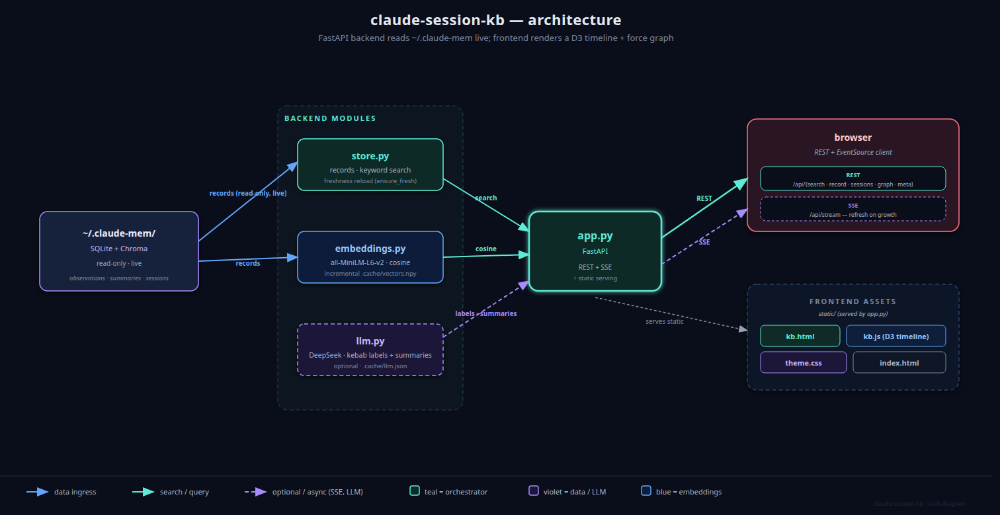
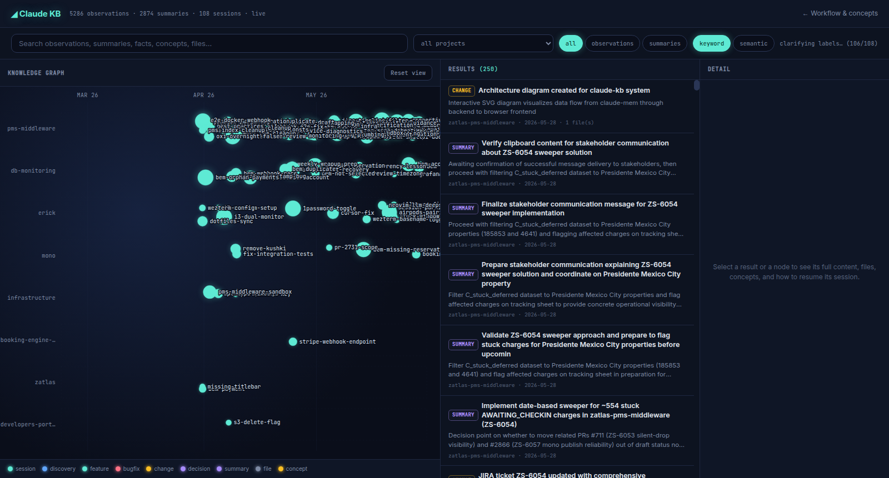

# Claude Knowledge Base

A small local web app that makes the knowledge in your [claude-mem](https://github.com/thedotmack/claude-mem)
store browsable and searchable — a **timeline of your sessions** across projects, plus
**keyword and semantic search** over every observation and summary claude-mem has captured.
A FastAPI backend reads `~/.claude-mem` live (read-only) and stays current as you work.



- **Explainer + complete guide** (`/`) — the per-task session workflow (`ctask` / `cont` /
  `cresume` / `cfind`) and how to use every feature of the KB.
- **Knowledge base** (`/kb.html`) — timeline + search + drill-down.

## Run it

```bash
pip install -r requirements.txt      # fastapi, uvicorn, numpy, transformers, torch
python app.py                        # serves http://127.0.0.1:8000
```

Open <http://127.0.0.1:8000> for the guide, or <http://127.0.0.1:8000/kb.html> for the KB.

On first start the server reads claude-mem and builds the semantic index in the background
(embeds every record once with `all-MiniLM-L6-v2` — a few minutes on CPU). **Keyword search
works immediately**; semantic search switches on once indexing finishes. The index is cached
to `.cache/`, so subsequent starts are fast and only new records get embedded.

## What it looks like

### Timeline overview — your sessions across projects, over time



Each project gets a horizontal swimlane. Sessions are teal circles at their start time,
sized by activity, labelled with a kebab-case topic (`stuck-charges`, `opera-cloud`,
`zif-overcharge-bug`). Wheel-zoom and drag-pan the time axis. Hover a session to dim other
lanes; click to drill in.

When you type a query, the timeline narrows to just the sessions that contain hits, sized
by hit count. Semantic mode (the chip beside the search box) ranks the same set by meaning
instead of literal keyword.

### Drill-down — one session expanded into its observations


Click any session: the view switches to a force graph of that session's observations and
summaries, colour-coded by record type (blue = discovery, violet = summary, red = bugfix,
amber = change). Each one carries a single-word label picked from its own title. Click
**← all sessions** to return to the timeline.

## How it works

- **No rebuild step.** The backend re-reads claude-mem whenever it grows (`ensure_fresh`),
  so the API is always current. Semantic queries are embedded **server-side** — no model in
  the browser.
- **SSE for freshness only.** Search is plain request/response; `/api/stream` pushes a
  `refresh` event when claude-mem gains new entries, and the page re-runs the current view
  automatically.
- **Two views, one app.** Timeline = chronology across projects (overview). Force graph =
  one session expanded (drill-down). They share search/filter state and live freshness.

## API

| Endpoint | Purpose |
|---|---|
| `GET /api/meta` | counts, projects, freshness, indexing + enrichment status |
| `GET /api/search?q=&project=&kind=&mode=keyword\|semantic&session=&limit=` | ranked records |
| `GET /api/record/{id}` | one record + its session |
| `GET /api/sessions?project=` | sessions (with kebab labels + LLM summaries when enriched) |
| `GET /api/graph?project=` | session-overview nodes + shared-file links (kept for a future map toggle; currently unused) |
| `GET /api/stream` | SSE; `refresh` when claude-mem grows, else `ping` with progress |

## Files

| File | Role |
|------|------|
| `app.py` | FastAPI: REST + SSE + serves the frontend (no-cache + version-busted assets) |
| `store.py` | Live read of claude-mem, keyword search, freshness reload, TF-IDF labels |
| `embeddings.py` | `all-MiniLM-L6-v2` embeddings, cosine search, incremental disk cache |
| `llm.py` | Optional DeepSeek client for kebab labels + 1–2 sentence session summaries |
| `static/index.html` | Explainer + complete user guide (13 sections, D3 diagrams) |
| `static/kb.html` + `static/kb.js` | The KB UI — D3 timeline + force graph + EventSource client |
| `static/theme.css` | Shared dark "observatory" theme (Inter + JetBrains Mono) |
| `shell/claude.sh` | Per-task session helpers — see below |
| `.cache/` | Generated embedding cache + LLM cache (git-ignored) |

## Session workflow helpers (`shell/claude.sh`)

The guide documents a companion habit: **one slug per task**, shared across the Claude Code
session name, the terminal tab title, and an optional git worktree. Source the file from
your shell rc:

| Command | Does |
|---|---|
| `ctask <slug> [-w]` | start a new named session (`claude -n <slug>`), set the tab title, optionally make a worktree |
| `cont` | continue the most recent session in this directory |
| `cresume <slug>` | reopen a session by name |
| `cfind <phrase>` | find a past session by what was said in it |

## Optional LLM clarification (DeepSeek)

Set `DEEPSEEK_API_KEY` in your environment and the server will, in a background pass, ask
the LLM for:

- **A kebab-case topic label per session** — 1–3 lowercase tokens joined by hyphens
  (`stuck-charges`, `opera-cloud`, `ihg-awaiting-checkin`) — replacing the TF-IDF heuristic.
- **A 1–2 sentence summary per session** — shown in the detail panel when you click a
  session anchor.

Results cache to `.cache/llm.json`, keyed by content hash + the system prompt itself; any
prompt tweak invalidates only the affected entries. Cost is pennies on the first run, free
on every subsequent restart.

**Privacy:** session content (your prompts + claude-mem observation titles) goes to
DeepSeek's API under their TOS. If that's not acceptable for your data, leave
`DEEPSEEK_API_KEY` unset — the page degrades cleanly to the TF-IDF labels and an empty
session-detail card.

## Notes

- Everything is local and read-only against claude-mem; nothing is written back to it.
- D3 loads from a CDN (first open needs internet); the embedding model is server-side and
  is fetched once to `~/.cache/huggingface`.
- The full user guide (every feature, every interaction, every workflow) lives at `/` when
  the server is running — open <http://127.0.0.1:8000>.
